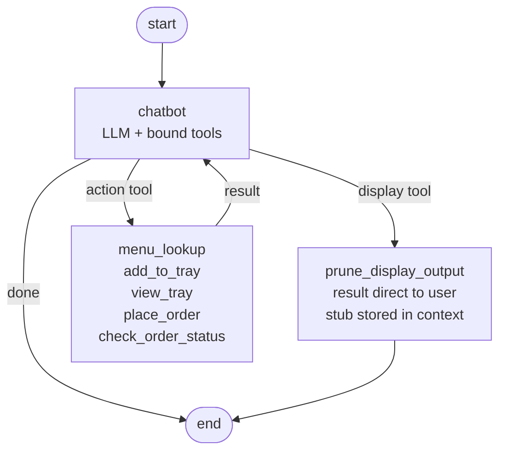

# AI Waiter — An Agentic LangGraph Tool-Calling Agent for Restaurant Ordering

An agentic AI waiter backed by a structured restaurant menu. The model autonomously decides when to call tools (add items, view tray, place order) and sequences multi-step actions — it is not a simple question-answer chatbot.

---

## Agent graph

The agent is built with [LangGraph](https://langchain-ai.github.io/langgraph/). The model runs in a loop, calling tools as needed until it has a final response to return to the user.



Flow: the LLM receives the system prompt and conversation history, then either responds directly (→ `__end__`) or emits a tool call (→ `tools`). Most tools loop back to `chatbot` for the LLM to interpret results. Display-only tools (`get_full_menu`, `list_categories`) route to `prune_display_output` instead — the result is sent directly to the user and replaced with a compact stub in the message history, bypassing the LLM entirely.

---

## Getting started

See **[SETUP.md](SETUP.md)** for tooling requirements, environment setup, and repository layout.

---

## Running the AI waiter

### Prerequisites

- Python 3.10+
- [uv](https://docs.astral.sh/uv/) package manager
- A Google Gemini API key — required when using `MODEL=google_genai:*`; set in `.env` (see `.env_example`)
- [Ollama](https://ollama.com) running locally — required when using `MODEL=ollama:*`; model must support tool-calling (`llama3.2`, `qwen2.5`, `mistral-nemo` — `gemma3` does not)

### Setup

```bash
uv sync
cp .env_example .env   # then edit MODEL and any required keys
```

### Start the chatbot

```bash
uv run console.py           # standard
uv run console.py --trace   # with tool + token tracing
```

The program starts an interactive terminal session. The waiter greets you, then responds to natural-language input.

### Start Webserver Chatbot

```bash
uv run python server.py                    # standard
uv run python server.py --trace            # with tool + token tracing
uv run python server.py --trace --port 9000  # custom port
```

Access the chatbot [http://localhost:8000](http://localhost:8000)


### What you can do

| Intent | Example input |
|---|---|
| See the full menu | `show me the menu` |
| Explore food categories | `what kind of food do you have?` |
| Search for specific items | `what dosas do you have?` |
| Add items | `I'd like 2 masala dosas and a coffee` |
| Review your tray | `what's in my tray?` |
| Remove an item | `remove the coffee` |
| Place the order | `yes, place the order` |
| Check order status | `what's the status of my order?` |
| Chat in your language | works in Kannada, Tamil, Telugu, Hindi, Malayalam, and more |
| Quit | `quit` or `exit` |

### Order status simulation

After placing an order the status advances automatically in the background:

```
placed → preparing (after 1 min) → ready (after 2 min) → served (after 3 min)
```

A notification is printed in the terminal each time the status changes.

### Demo Runs

[demo](./demo/)

---

## Menu data

The restaurant menu lives in `menu/`. Processing happens in two stages:

```
scanned-menu.json  →  [normalize-menu.py]  →  normalized-menu.json
                                                       ↓
                                              [translate.py]  →  menu.json
```

- `normalize-menu.py` — normalises structure, IDs, timings, and name casing
- `translate.py` — adds translations for 10 Indian languages via the model in `.env` (run once)

See **[menu/README.md](menu/README.md)** for:
- Input and output JSON structure
- Field reference (camelCase, multilingual text arrays, availability windows)
- Item splitting rules (dry/gravy variants, slash-choice items)
- How to regenerate `menu/menu.json`

Quick regeneration:
```bash
uv run python menu/normalize-menu.py   # scanned-menu.json → normalized-menu.json
uv run python menu/translate.py        # normalized-menu.json → menu.json (with translations)
```
