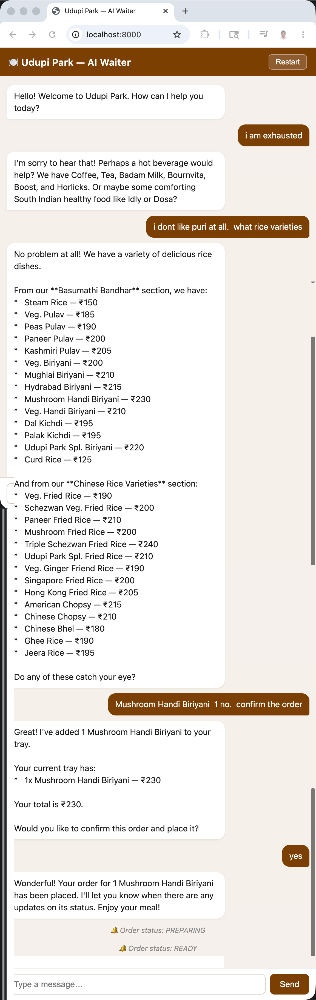
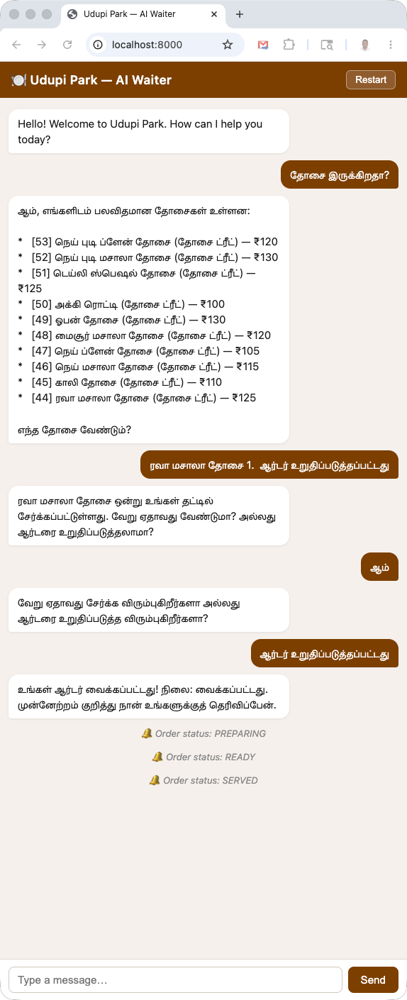

# Demo Run

[Console](#terminal-runtime---consolepy) | [Server](#webserver-with-web-sockets---serverpy) | [Conversation](#the-order-conversation) | [Order Cost](#single-order-cost) | [Performance Trace](#order-and-performance-trace)

## Terminal runtime - console.py

`uv run python console.py`


```txt
warning: `VIRTUAL_ENV=~/ai-waiter/.venv` does not match the project environment path `.venv` and will be ignored; use `--active` to target the active environment instead
============================================================
  Welcome to Udupi Park Restaurant
  (type 'quit'/'exit' to leave, 'restart' to reset)
============================================================

Waiter: Hello! Welcome to Udupi Park. How can I help you today?

You: need a cup of tea with milk 

Waiter: Great! I've added one cup of Tea to your tray. Is there anything else I can get for you? Perhaps some dosas or idlis? They are quite popular!

You: no. just confirm the tea order

Waiter: Your current tray has 1 Tea for a total of ₹32. Would you like to confirm and place this order?

You: yes

Waiter: Great! Your order has been placed. I'll keep you updated on its status.

You: 
[Order update] Status changed to: PREPARING
You: exit
Thank you for visiting! Goodbye!
```

## WebServer with web sockets - server.py

```bash
uv run python server.py
```

Access the chatbot [http://localhost:8000](http://localhost:8000)

  

**Chat**
Hello! Welcome to Udupi Park. How can I help you today?
क्या आपके पास डोसा है?
हाँ, हमारे पास कई प्रकार के डोसे हैं:
*   [53] घी पुड़ी प्लेन डोसा (डोसा ट्रीट) — ₹120
*   [52] घी पुड़ी मसाला डोसा (डोसा ट्रीट) — ₹130
*   [51] डेली स्पेशल डोसा (डोसा ट्रीट) — ₹125
*   [50] अक्की रोटी (डोसा ट्रीट) — ₹100
*   [49] ओपन डोसा (डोसा ट्रीट) — ₹130
*   [48] मैसूर मसाला डोसा (डोसा ट्रीट) — ₹120
*   [47] घी प्लेन डोसा (डोसा ट्रीट) — ₹105
*   [46] घी मसाला डोसा (डोसा ट्रीट) — ₹115
*   [45] खाली डोसा (डोसा ट्रीट) — ₹110
*   [44] रवा मसाला डोसा (डोसा ट्रीट) — ₹125

आपको कौन सा डोसा चाहिए?
घी मसाला डोसा - 1 नग
आपके ट्रे में 1 घी मसाला डोसा (₹115 प्रत्येक) जोड़ दिया गया है।
ऑर्डर कन्फ़र्म हो गया
क्या आप ऑर्डर देना चाहेंगे?
पुष्टि करना
ऑर्डर दे दिया गया है! स्थिति: रखा गया। जैसे-जैसे यह आगे बढ़ेगा, मैं आपको अपडेट करता रहूँगा।

**Trace**

```txt
uv run server.py --trace
Starting server with model: google_genai:gemini-2.5-flash
INFO:     Started server process [43000]
INFO:     Waiting for application startup.
INFO:     Application startup complete.
INFO:     Uvicorn running on http://0.0.0.0:8000 (Press CTRL+C to quit)
INFO:     127.0.0.1:55937 - "WebSocket /ws" [accepted]
INFO:     connection open
[trace] llm call #1
[trace] llm call #2
[trace] tool → menu_lookup  args: {'terms': ['dosa']}
[trace] tool ← content="Found 10 match(es):\n  [53] Ghee Pudi Plain Dosa (Dosa Treat) — ₹120\n  [52] Ghee Pudi Masala Dosa (Dosa Treat) — ₹130\n  [51] Daily Spl. Dosa's (Dosa Treat) — ₹125\n  [50] Akki Rotti (Dosa Treat) — ₹100\n  [49] Open Dosa (Dosa Treat) — ₹130\n  [48] Mysore Masala Dosa (Dosa Treat) — ₹120\n  [47] Ghee Plain Dosa (Dosa Treat) — ₹105\n  [46] Ghee Masala Dosa (Dosa Treat) — ₹115\n  [45] Khali Dosa (Dosa Treat) — ₹110\n  [44] Rava Masala Dosa (Dosa Treat) — ₹125" name='menu_lookup' tool_call_id='00ef1547-f4d5-4563-a16d-da8295553467'
[trace] llm call #3
[trace] llm call #4
[trace] tool → add_to_tray  args: {'item_id': 46, 'quantity': 1}
[trace] tool ← content='Tray updated: 1× Ghee Masala Dosa (₹115 each).' name='add_to_tray' tool_call_id='b377453f-95ed-4175-9a8f-25c94db0c934'
[trace] llm call #5
[trace] llm call #6
[trace] llm call #7
[trace] tool → place_order  args: {}
[trace] tool ← content="Order placed! Status: placed. I'll keep you updated as it progresses." name='place_order' tool_call_id='6456ca24-c3d6-42c1-a941-6e521aadb8e8'
[trace] llm call #8
```

**API Usage & Cost**
* Gemini API Spend  ₹0.15
* No API Calls: 8 according to App
* No API calls: 10 according to Google AI Studio - in that 2 api calls with errors (service unavailable 503)?
* Number of Input Tokens: approx 7000
* Number of Output Tokens: approx 500
* Input Token Cost = (7000 / 1000000)*$0.3(0.025 paise) approx
* Output Token Cost = (500 / 1000000)*$2.5(0.10 paise) approx
* Total Cost Calculated = ₹0.32 - but actual reported delta is ₹0.15 = ₹0.48 - ₹0.33


**API Usage Cost When user asked for full menu**
* When full menu is printed through AI agent into chat it costed ₹2.74 - ₹0.48 = ₹1.26


## The Order conversation
```
uv run console.py       
============================================================
  Welcome to Udupi Park Restaurant
  Model: google_genai:gemini-2.5-flash
  (type 'quit'/'exit' to leave, 'restart' to reset)
============================================================
Waiter: Hello! Welcome to Udupi Park. How can I help you today?

You: it has been quite an hectic day.  I am bit tired. even lunch got so much delayed
Waiter: I'm sorry to hear you've had such a hectic day and a delayed lunch. You must be very hungry!

How can I assist you with your order? Would you like to see the menu, or do you have something specific in mind?

You: looks like dehydration
Waiter: I understand. Staying hydrated is very important, especially on a busy day.

We have a variety of refreshing drinks that might help. Would you like to see our drink options, or perhaps some fresh juices?

You: any juice that can give instant energy 
Waiter: I'm sorry, I couldn't find any specific juices labeled as "instant energy" in our menu.

However, we have a selection of fresh juices and other beverages that might help you feel refreshed. Would you like to see the available juices, or perhaps our coffee and tea options for a boost?

You: what juices you have
Waiter: We have a variety of fresh fruit juices:

*   Butter Milk — ₹75
*   Lime Juice — ₹70
*   Sweet Lassi — ₹85
*   Khara Lassi — ₹85
*   Fresh Lime Soda — ₹80
*   Mango (Seasonal) — ₹120
*   Pomegranate — ₹110
*   Muskmelon — ₹95
*   Watermelon — ₹95
*   Cocktail — ₹105

Would any of these sound refreshing to you?

You: is sugar in juice good for man?
Waiter: As an AI waiter, I'm not qualified to give health advice. However, if you're looking for something refreshing, many of our juices are naturally sweet from the fruit.

Would you like to know more about any specific juice or perhaps something else from the menu?

You: i have problem with added sugar
Waiter: I understand. If you're looking to avoid added sugar, our **Lime Juice** or **Fresh Lime Soda** might be good options, as they can be made with less or no sugar. We also have **Butter Milk**, which is a savory and refreshing drink.

Would you like to try any of these, or would you prefer something else?

You: oh that carbonated drinks are also bad for health - right?
Waiter: I'm sorry, I can't give medical or health advice. My role is to help you with our menu.

If you're looking for something without carbonation and with less or no added sugar, the **Lime Juice** or **Butter Milk** could be good choices.

Would you like to order any of these, or perhaps something else from our menu?

You: Pomegranate improves the gut - right?
Waiter: I cannot provide health advice, as I am an AI assistant.

However, if you're interested in a refreshing drink, we do have **Pomegranate juice** for ₹110. Would you like to add that to your tray?

You: yes 1 glass
Waiter: Great! I've added one Pomegranate juice to your tray. That will be ₹110.

Would you like anything else, or are you ready to place your order?

You: no
Waiter: Okay. So, just to confirm, you would like one Pomegranate juice for ₹110.

Are you ready to place your order now?

You: oh you didnt order it yet.  please rush it
Waiter: Your order for one Pomegranate juice has been placed! It's currently in "placed" status. I'll let you know when it's ready.


You: 
[Order update] Status changed to: PREPARING
You: 
[Order update] Status changed to: READY
You: exit
Thank you for visiting! Goodbye! 
```


## Single Order Cost
After [optimizing Input / Output token usage](../docu/io-tokens-optimized.md), a single order with 2 items costed as given below

```
43.97 Before run Google API Spend
44.13 After run Google API Spend
-----
00.16 Single Order Cost for LLM usage
```
**doubtful if we got full spend details at this time**


## Order and Performance Trace

`uv run server.py --trace`

**Conversation**
```txt
Hello! Welcome to Udupi Park. How can I help you today?
need some snacks
Found 26 section(s):
  [Hot Beverages] — 6 item(s)
    Includes: Coffee, Tea, Badam Milk
  [South Healthy Food] — 20 item(s)
    Includes: Idly (2) Vada (1), Idly (1) Vada (1), Thatte Idly
  [Dosa Treat] — 24 item(s)
    Includes: Masala Dosa, Plain Dosa, Onion Dosa
  [Soup Varieties] — 16 item(s)
    Includes: Mushroom with Veg. Soup, Udupi Park Special Soup, Lemon Coriander Soup
  [Tasty Starters] — 41 item(s)
    Subsections: Manchurian / Chilly (12), Pepper Dry (5), Our Special Starters (24)
  [Manchurian Gravy] — 7 item(s)
    Includes: Veg. Ball Manchurian, Veg. Ball Garlic Sauce, Veg. Ball Ginger Sauce
  [Tandoori Starters] — 7 item(s)
    Includes: Paneer Tikka, Mushroom Tikka, Baby Corn Tikka
  [Tandoori Bread] — 23 item(s)
    Includes: Roti, Nan, Kulcha
  [North Indian Dishes] — 39 item(s)
    Includes: Dal Fry, Dal Tadka, Dal Palak
  [Special Kadai Dishes] — 5 item(s)
    Includes: Veg Kollapuri, Kadai Mix Veg., Kadai Mushroom
  [Jain Option] — 4 item(s)
    Includes: Paneer Butter Masala, Veg. Makhanwala, Veg. Shahi Kurma
  [Dry Veg.] — 4 item(s)
    Includes: Aloo Jeera Dry, Aloo Capsicum Dry, Paneer Burji
  [Special Make North Dishes] — 7 item(s)
    Includes: Paneer Tikka Masala, Paneer Pasand, Veg. Patiyala
  [Basumathi Bandhar] — 14 item(s)
    Includes: Steam Rice, Veg. Pulav, Peas Pulav
  [Salads And Raitha] — 6 item(s)
    Includes: Green Salad, Mix Raitha, Boondi Raitha
  [Meals] — 4 item(s)
    Includes: South Executive, North Executive, North Deluxe
  [Chinese Rice Varieties] — 14 item(s)
    Includes: Veg. Fried Rice, Schezwan Veg. Fried Rice, Paneer Fried Rice
  [Noodles Varieties] — 5 item(s)
    Includes: Veg. Noodles, Schezwan Noodles, Mushroom Noodles
  [Pav Bhaji Varieties] — 6 item(s)
    Includes: Pav Bhaji, Paneer Pav Bhaji, Cheese Pav Bhaji
  [Chats Stall] — 13 item(s)
    Includes: Udupi Park Spl. Chat, Pani Puri, Masala Puri
  [Cream Of Parlour] — 10 item(s)
    Includes: Vanilla, Strawberry, Mango
  [Special Make Ice Creams] — 22 item(s)
    Includes: Fried Ice Cream, Gud Bud, Banana Split
  [Sandwiches] — 8 item(s)
    Includes: Veg. Sandwich, Veg. Cheese Sandwich, Cheese Sandwich
  [Fresh Fruit Juices] — 15 item(s)
    Includes: Mosambi, Orange (Seasonal), Pineapple
  [Milk Shakes] — 12 item(s)
    Includes: Apple, Chikku, Mango (Seasonal)
  [Mocktails] — 7 item(s)
    Includes: Fruit Punch, Blue Lagoon, Orange Lemonade
Paneer Tikka 1 plate, Mushroom Tikka 1 plate
We have a few options for Paneer Tikka and Mushroom Tikka.

For Paneer Tikka, we have:
*   Paneer Tikka Masala (Special Make North Dishes) — ₹280 (ID: 213)
*   Hariyali Paneer Tikka (Tandoori Starters) — ₹285 (ID: 130)
*   Malai Paneer Tikka (Tandoori Starters) — ₹280 (ID: 128)
*   Paneer Tikka (Tandoori Starters) — ₹270 (ID: 125)

For Mushroom Tikka, we have:
*   Hariyali Mushroom Tikka (Tandoori Starters) — ₹270 (ID: 131)
*   Malai Mushroom Tikka (Tandoori Starters) — ₹270 (ID: 129)
*   Mushroom Tikka (Tandoori Starters) — ₹260 (ID: 126)

Could you please specify which ones you'd like?
Paneer Tikka Masala  1 plate; Hariyali Mushroom Tikka 1 plate
I've added Paneer Tikka Masala and Hariyali Mushroom Tikka to your tray. Is there anything else I can get for you?
no
Your current tray has:
*   1x Paneer Tikka Masala - ₹280
*   1x Hariyali Mushroom Tikka - ₹270
Total: ₹550

Would you like to place this order?
yes
Your order has been placed! The current status is "placed". I'll let you know once it's ready.
```

**Trace**
```txt
uv run server.py --trace
Starting server with model: google_genai:gemini-2.5-flash
INFO:     Started server process [8819]
INFO:     Waiting for application startup.
INFO:     Application startup complete.
INFO:     Uvicorn running on http://0.0.0.0:8000 (Press CTRL+C to quit)
INFO:     127.0.0.1:53777 - "WebSocket /ws" [accepted]
INFO:     connection open
[trace] llm call #1
INFO:     127.0.0.1:53780 - "GET /favicon.ico HTTP/1.1" 404 Not Found
[trace] tokens  in=1318 out=16  (session total in=1318 out=16 calls=1)  llm=1384ms  session=7.8s
[trace] llm call #2
[trace] tokens  in=1339 out=86  (session total in=2657 out=102 calls=2)  llm=1711ms  session=20.5s
[trace] tool → list_categories  args: {'lang': 'en'}
[trace] tool ← content='Found 26 section(s):\n  [Hot Beverages] — 6 item(s)\n    Includes: Coffee, Tea, Badam Milk\n  [South Healthy Food] — 20 item(s)\n    Includes: Idly (2) Vada (1), Idly (1) Vada (1), Thatte Idly\n  [Dosa Treat] — 24 item(s)\n    Includes: Masala Dosa, Plain Dosa, Onion Dosa\n  [Soup Varieties] — 16 item(s)\n    Includes: Mushroom with Veg. Soup, Udupi Park Special Soup, Lemon Coriander Soup\n  [Tasty Starters] — 41 item(s)\n    Subsections: Manchurian / Chilly (12), Pepper Dry (5), Our Special Starters (24)\n  [Manchurian Gravy] — 7 item(s)\n    Includes: Veg. Ball Manchurian, Veg. Ball Garlic Sauce, Veg. Ball Ginger Sauce\n  [Tandoori Starters] — 7 item(s)\n    Includes: Paneer Tikka, Mushroom Tikka, Baby Corn Tikka\n  [Tandoori Bread] — 23 item(s)\n    Includes: Roti, Nan, Kulcha\n  [North Indian Dishes] — 39 item(s)\n    Includes: Dal Fry, Dal Tadka, Dal Palak\n  [Special Kadai Dishes] — 5 item(s)\n    Includes: Veg Kollapuri, Kadai Mix Veg., Kadai Mushroom\n  [Jain Option] — 4 item(s)\n    Includes: Paneer Butter Masala, Veg. Makhanwala, Veg. Shahi Kurma\n  [Dry Veg.] — 4 item(s)\n    Includes: Aloo Jeera Dry, Aloo Capsicum Dry, Paneer Burji\n  [Special Make North Dishes] — 7 item(s)\n    Includes: Paneer Tikka Masala, Paneer Pasand, Veg. Patiyala\n  [Basumathi Bandhar] — 14 item(s)\n    Includes: Steam Rice, Veg. Pulav, Peas Pulav\n  [Salads And Raitha] — 6 item(s)\n    Includes: Green Salad, Mix Raitha, Boondi Raitha\n  [Meals] — 4 item(s)\n    Includes: South Executive, North Executive, North Deluxe\n  [Chinese Rice Varieties] — 14 item(s)\n    Includes: Veg. Fried Rice, Schezwan Veg. Fried Rice, Paneer Fried Rice\n  [Noodles Varieties] — 5 item(s)\n    Includes: Veg. Noodles, Schezwan Noodles, Mushroom Noodles\n  [Pav Bhaji Varieties] — 6 item(s)\n    Includes: Pav Bhaji, Paneer Pav Bhaji, Cheese Pav Bhaji\n  [Chats Stall] — 13 item(s)\n    Includes: Udupi Park Spl. Chat, Pani Puri, Masala Puri\n  [Cream Of Parlour] — 10 item(s)\n    Includes: Vanilla, Strawberry, Mango\n  [Special Make Ice Creams] — 22 item(s)\n    Includes: Fried Ice Cream, Gud Bud, Banana Split\n  [Sandwiches] — 8 item(s)\n    Includes: Veg. Sandwich, Veg. Cheese Sandwich, Cheese Sandwich\n  [Fresh Fruit Juices] — 15 item(s)\n    Includes: Mosambi, Orange (Seasonal), Pineapple\n  [Milk Shakes] — 12 item(s)\n    Includes: Apple, Chikku, Mango (Seasonal)\n  [Mocktails] — 7 item(s)\n    Includes: Fruit Punch, Blue Lagoon, Orange Lemonade' name='list_categories' tool_call_id='bcd28a44-02c5-497f-8cce-55b0b71a5a66'  (1ms)
[trace] llm call #3
[trace] tokens  in=1403 out=23  (session total in=4060 out=125 calls=3)  llm=1525ms  session=104.2s
[trace] tool → menu_lookup  args: {'terms': ['Paneer Tikka'], 'lang': 'en'}
[trace] tool ← content='Found 4 match(es):\n  [213] Paneer Tikka Masala (Special Make North Dishes) — ₹280\n  [130] Hariyali Paneer Tikka (Tandoori Starters) — ₹285\n  [128] Malai Paneer Tikka (Tandoori Starters) — ₹280\n  [125] Paneer Tikka (Tandoori Starters) — ₹270' name='menu_lookup' tool_call_id='14cb35bc-30ea-448d-8a39-616807e881a5'  (2ms)
[trace] llm call #4
[trace] tokens  in=1548 out=23  (session total in=5608 out=148 calls=4)  llm=912ms  session=105.1s
[trace] tool → menu_lookup  args: {'terms': ['Mushroom Tikka'], 'lang': 'en'}
[trace] tool ← content='Found 3 match(es):\n  [131] Hariyali Mushroom Tikka (Tandoori Starters) — ₹270\n  [129] Malai Mushroom Tikka (Tandoori Starters) — ₹270\n  [126] Mushroom Tikka (Tandoori Starters) — ₹260' name='menu_lookup' tool_call_id='1731a971-ba60-430e-944b-61b5a5661163'  (2ms)
[trace] llm call #5
[trace] tokens  in=1665 out=244  (session total in=7273 out=392 calls=5)  llm=1836ms  session=107.0s
[trace] llm call #6
[trace] tokens  in=1930 out=127  (session total in=9203 out=519 calls=6)  llm=1714ms  session=136.0s
[trace] tool → add_to_tray  args: {'item_id': 213, 'quantity': 1}
[trace] tool ← content='Tray updated: 1× Paneer Tikka Masala (₹280 each).' name='add_to_tray' tool_call_id='5c129b0f-3329-410f-aad9-22160c603f7f'  (1ms)
[trace] llm call #7
[trace] tokens  in=1991 out=26  (session total in=11194 out=545 calls=7)  llm=1372ms  session=137.4s
[trace] tool → add_to_tray  args: {'item_id': 131, 'quantity': 1}
[trace] tool ← content='Tray updated: 1× Hariyali Mushroom Tikka (₹270 each).' name='add_to_tray' tool_call_id='98eb435d-8e77-4a65-8ef0-da09e1275127'  (1ms)
[trace] llm call #8
[trace] tokens  in=2052 out=31  (session total in=13246 out=576 calls=8)  llm=3680ms  session=141.1s
[trace] llm call #9
[trace] tokens  in=2086 out=10  (session total in=15332 out=586 calls=9)  llm=1204ms  session=150.4s
[trace] tool → view_tray  args: {}
[trace] tool ← content='Current tray:\n  1× Paneer Tikka Masala — ₹280 × 1 = ₹280\n  1× Hariyali Mushroom Tikka — ₹270 × 1 = ₹270\nTotal: ₹550' name='view_tray' tool_call_id='4ef595be-8832-477d-88d2-95d8c2c39dbc'  (0ms)
[trace] llm call #10
[trace] tokens  in=2168 out=53  (session total in=17500 out=639 calls=10)  llm=1435ms  session=151.8s
[trace] llm call #11
[trace] tokens  in=2224 out=36  (session total in=19724 out=675 calls=11)  llm=1360ms  session=156.5s
[trace] tool → place_order  args: {}
[trace] tool ← content="Order placed! Status: placed. I'll keep you updated as it progresses." name='place_order' tool_call_id='92b600ff-87b8-43b7-a72d-fcb6c91987a7'  (1ms)
[trace] llm call #12
[trace] tokens  in=2265 out=25  (session total in=21989 out=700 calls=12)  llm=1430ms  session=158.0s
```
### Analysis

**Session: greet → list categories → Paneer Tikka + Mushroom Tikka → add both → view → place order (12 LLM calls)**

| Turn | LLM call | In tokens | Delta-in | What delta-in contains | Out tokens |
|---|---|---|---|---|---|
| Greeting | #1 | 1 318 | 1 318 | system prompt + tool schemas + "Hello" | 16 |
| "what do you have?" → list_categories | #2 | 1 339 | +21 | user message | 86 |
| *(short-circuit — no LLM call)* | — | — | +58* | stub added to history | **0** |
| → menu_lookup Paneer Tikka | #3 | 1 403 | +64 | user msg + LLM tool-call msg + stub | 23 |
| → menu_lookup Mushroom Tikka | #4 | 1 548 | +145 | LLM msg + 4-line Paneer Tikka results | 23 |
| presents both results | #5 | 1 665 | +117 | LLM msg + 3-line Mushroom Tikka results | **244** |
| user confirms → add_to_tray #1 | #6 | 1 930 | **+265** | LLM's 244-token reply + user confirmation | 127 |
| → add_to_tray #2 | #7 | 1 991 | +61 | LLM msg + tray update #1 | 26 |
| tray reply | #8 | 2 052 | +61 | LLM msg + tray update #2 | 31 |
| "what's in my tray?" → view_tray | #9 | 2 086 | +34 | user msg + LLM reply | 10 |
| tray summary → confirm? | #10 | 2 168 | +82 | LLM msg + tray contents | 53 |
| "yes" → place_order | #11 | 2 224 | +56 | user msg + LLM reply | 36 |
| order confirmation | #12 | 2 265 | +41 | LLM msg + order status | 25 |
| **Session total** | **12 calls** | **21 989** | **2 265** | | **700** |

_\* Stub enters context on call #3._

**Key observations:**

1. **list_categories short-circuit worked** — no LLM call between #2 and #3, zero output tokens for that response.

2. **Sequential menu_lookup calls (#3 and #4)** — the LLM looked up Paneer Tikka and Mushroom Tikka in separate calls instead of one batched call. This costs one extra LLM round-trip and causes call #5 to output 244 tokens (a long comparison of both results).

3. **+265 delta on call #6 is the most expensive single delta** — entirely caused by call #5's 244-token verbose output becoming input on the next turn. Two sequential lookups → verbose explanation → large context growth.

4. **Call #8 outlier (3 680ms LLM latency)** — normal Gemini jitter, not a code issue.

5. **All local tool calls: 0–2ms** — no bottleneck there.

**Fix:** Add to SYSTEM_PROMPT — *"When the user asks for multiple items, pass all terms in a single `menu_lookup` call rather than one call per item."* This would eliminate call #4 and shrink call #5's output, reducing total tokens by roughly 500–600.